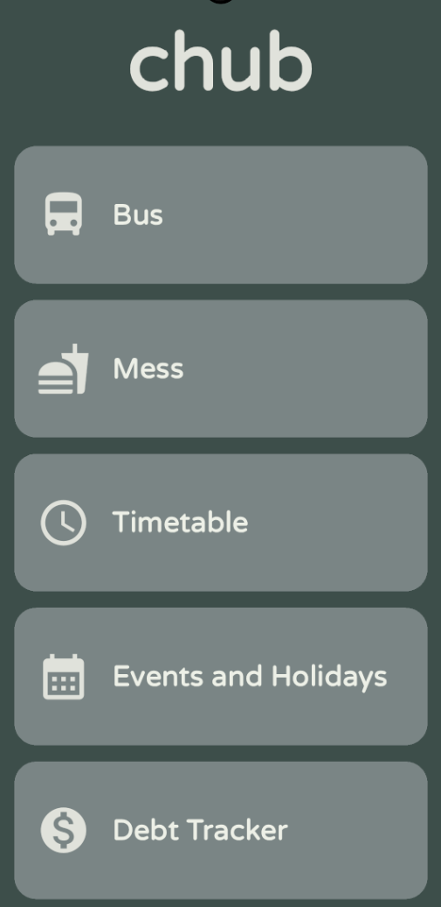

# Chub - Student Tracker App

A Flutter application designed to help students manage their daily activities and track important information including bus schedules, mess timings, class timetables, events, holidays, and personal debt tracking.


## ✨ Features

- 🚌 **Bus Tracker** - View bus schedules for weekdays and weekends/holidays with real-time next bus information
- 🍽️ **Mess Schedule** - Track mess menu
- 📅 **Timetable** - View your class schedule organized by day
- 📆 **Events & Holidays** - Keep track of upcoming events and holidays
- 💰 **Debt Tracker** - Manage and track personal debts and expenses with add/remove functionality

The app features a modern dark theme with a clean, intuitive UI built with Flutter Material Design.

### Home Screen



## 🚀 Getting Started

### Prerequisites

Before you begin, ensure you have the following installed:

- **Flutter SDK** (3.7.0 or higher) - [Install Flutter](https://docs.flutter.dev/get-started/install)
- **Dart SDK** (comes with Flutter)
- **Android Studio** / **Xcode** (for mobile development)
- **Git** (for cloning the repository)
- An IDE - **VS Code** or **Android Studio** (recommended)

### Installation & Setup

1. **Clone the repository**
   ```bash
   git clone https://github.com/Mayur404/Chub.git
   cd Chub
   ```

2. **Install dependencies**
   ```bash
   flutter pub get
   ```

3. **Verify the setup**
   ```bash
   flutter doctor
   ```
   Make sure all checks pass (especially for your target platform).

4. **Run the app**
   ```bash
   flutter run
   ```
   Or use your IDE's run button (F5 in VS Code).

### Platform-Specific Setup

#### Android
- No additional setup required if you have Android Studio installed
- Gradle will automatically download dependencies on first build

#### iOS (macOS only)
- Requires Xcode installed
- Run `cd ios && pod install` before first build
- Make sure you have a valid Apple Developer account for device testing

#### Web
- Enable web support: `flutter config --enable-web`
- Run: `flutter run -d chrome`

#### Windows/Linux/macOS Desktop
- Enable desktop support: `flutter config --enable-windows-desktop` (or `--enable-linux-desktop` / `--enable-macos-desktop`)
- Run normally: `flutter run`

## 📁 Project Structure

```
Chub/
├── lib/
│   ├── main.dart                 # App entry point
│   ├── api_service.dart          # API service for fetching data
│   └── pages/
│       ├── home.dart             # Home screen with navigation
│       ├── bus.dart              # Bus schedule page
│       ├── mess.dart             # Mess schedule page
│       ├── timetable.dart        # Class timetable page
│       ├── events_and_holidays.dart  # Events and holidays page
│       └── debt_tracker.dart     # Debt tracking page
├── assets/
│   └── icons/                    # App icons and images
├── fonts/                        # Custom font files
├── test/                         # Unit and widget tests
├── android/                      # Android platform files
├── ios/                          # iOS platform files
├── web/                          # Web platform files
├── windows/                      # Windows platform files
├── linux/                        # Linux platform files
├── macos/                        # macOS platform files
├── pubspec.yaml                  # Project dependencies and configuration
└── README.md                     # This file
```

## 📦 Dependencies

Key packages used in this project:

- `http: ^1.3.0` - For API calls and network requests
- `shared_preferences: ^2.2.2` - For local data storage and caching
- `intl: ^0.19.0` - For date/time formatting
- `flutter_svg: ^2.0.17` - For SVG image support
- `flutter_launcher_icons: ^0.14.3` - For app icon generation

See `pubspec.yaml` for the complete list of dependencies.

## 🎨 Custom Fonts

The app uses several custom fonts:
- **LilitaOne** - Decorative font
- **Child** - Playful font
- **Please** - Handwritten style
- **Sacrifice** - Unique display font
- **Roboto** - Standard sans-serif
- **Round** - Default app font (custom)

Fonts are configured in `pubspec.yaml` and can be used throughout the app.

## 🔌 API Integration

The app fetches data from Google Apps Script endpoints. API URLs are configured in the respective page files:

- Bus schedule: Configured in `lib/pages/bus.dart`
- Mess menu: Configured in `lib/pages/mess.dart`
- Other endpoints: Check individual page files

**Note:** Make sure the API endpoints are accessible and returning data in the expected format.

## 🛠️ Building for Production

### Android APK
```bash
flutter build apk --release
```
Output: `build/app/outputs/flutter-apk/app-release.apk`

### Android App Bundle (for Play Store)
```bash
flutter build appbundle --release
```
Output: `build/app/outputs/bundle/release/app-release.aab`
